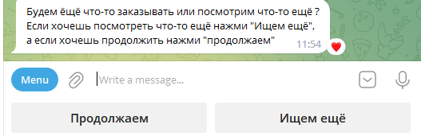

# Telegrambot

Туториал по командам и архитектуре бота:
 

 
 

1. /start Запуск бота.
2. /product: Подбор интересущего продукта и в последсвии заказ.
3. /help Вывод списка команд с кратким описанием.
4. /history История поиска товаров.

---
Основная часть работы бота находится в команде  */product* 
При использовании команды /product, бот интересуется что мы ищем и выводит товары которые могут нас интересовать

Так же бот показывает лучшее предложение  

Далее мы можем искать новые товары, либо перейти к заказу интересующего

---
Вывод списка команд */help*

---
Команда */history* показывает историю поиска товаров.

---
Все команды находятся в пакете "handlers". В этом пакете находятся как стандартные команды такие как */start*, */help*. 
Так и кастомные такие как */product*, */history* 

----

Работа с АПИ находится пакете "SITE_API" 

----

Создание и настройка всех кнопок происходит в пакете "Keyboards" 

----
Инициализация состояний происходит в пакете "states" 

